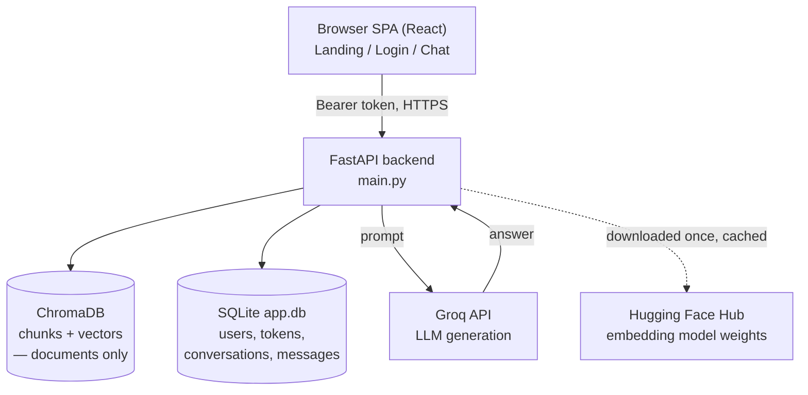

# Docs Assistant — RAG Chatbot

A general-purpose document-RAG chatbot built as a 2-day demo, following `plan.md`. It answers
questions only from whatever's been indexed into `backend/corpus/`, citing the source files it
used — and says so when the corpus doesn't cover something, instead of guessing. It isn't tied
to any one topic; the corpus currently mixes technical docs, a fictional company handbook, and
general reference guides to prove that out.

**This is a working demo, not a tuned system.** Baseline recall@5 is 95% (19/20) on the eval
set in [`eval/questions.json`](eval/questions.json) — see [`eval/eval.py`](eval/eval.py) and the
Follow-up section below for the tuning work that was deliberately skipped.

## Architecture



**Two persistence layers, deliberately never mixed**: Chroma holds the document corpus (what
the bot can cite) and nothing else — it has no idea a "user" or "conversation" exists. SQLite
(`app.db`) holds identity and chat history and nothing about document content. Neither store's
schema needs to know about the other, and wiping one to rebuild it (e.g. `ingest.py`'s full
`reset_collection()`) can never touch the other.

**Request flow — asking a question** (`POST /chat`, see `main.py` → `rag.py`):
1. `get_current_user()` resolves the bearer token to a user via `auth_tokens` in SQLite, or 401s.
2. If a `conversation_id` was sent, its prior messages are loaded from SQLite and turned into
   `{question, answer}` pairs — this is the multi-turn history, assembled **server-side**, not
   trusted from the client. No `conversation_id` → a new conversation row is created.
3. If there's history, `rag.rewrite_standalone_query()` asks Groq to rewrite a follow-up like
   "what about the async version?" into something retrieval can actually search on.
4. That query is embedded (`bge-small-en-v1.5`) and searched against Chroma — top-`k` chunks by
   cosine distance.
5. The best hit's distance is checked against `RELEVANCE_THRESHOLD`. Below it: chunks go into
   the prompt, Groq answers grounded in them. Above it: no context sent, Groq answers from its
   own knowledge — either way, nothing in the UI calls out which mode was used.
6. Both the question and the answer are written to SQLite as new rows in `messages`, and the
   conversation's `title`/`updated_at` are touched. The response carries `sources`, `grounded`,
   and the `conversation_id` (new or existing) back to the client.

**Request flow — adding a document** (`POST /upload`, see `main.py` → `pdf_to_markdown.py` →
`common.add_document_to_index()`): a PDF is converted to Markdown, saved under
`backend/corpus/uploads/`, chunked on headings, embedded, and added to the **live** Chroma
collection with a scoped delete-then-add keyed on that one file's path — never a full
`reset_collection()` rebuild, so one upload never costs re-embedding the whole corpus, and it's
visible to the next `/chat` call in the same process immediately (no restart needed). The
`ingest.py` CLI path (batch/offline conversion) walks the whole `corpus/` folder and always does
the full rebuild, since it has no notion of "just this one file changed."

**Deployment (planned, not live yet)**: frontend on Vercel, backend on Hugging Face Spaces
(Docker). HF Spaces' free tier has ephemeral storage — it wipes `app.db` and any uploaded
documents on every restart/rebuild, which would silently break cross-device history — so
`app.db` is moving to **Turso** (a hosted, SQLite-compatible database) rather than staying a
local file once deployed. The document corpus itself is fine either way, since it's rebuildable
from `backend/corpus/` (baked into the Docker image at build time via `ingest.py`).

## What it indexes

116 Markdown files, deliberately spanning unrelated domains to prove the bot doesn't assume a
single topic:

- **FastAPI's own docs** ([fastapi/fastapi](https://github.com/fastapi/fastapi), `docs/en/docs`)
  — tutorial, advanced, deployment, and how-to guides. Pruned down from the full docs tree:
  dropped the auto-generated API reference pages, a translation-testing fixture, and
  project-meta/marketing pages (`fastapi-cli.md`, `features.md`, `release-notes.md`,
  `contributing.md`, and similar — real prose about the project itself, not about using it).
- **A fictional company employee handbook** (`company/employee-handbook.md`) — invented company
  ("Nimbus Cascade Inc."), invented specific facts (leave policy, expense limits, tool names),
  used to prove the model is actually grounding on retrieved text rather than its own training
  data — see the retrieval/generation notes below.
- **General reference guides** (`general/`) — sports, gym/strength training, health & wellness,
  and personal finance. Real, broadly-accurate general knowledge, added to stress-test retrieval
  across topics with zero overlap with the rest of the corpus.

See [`backend/corpus/`](backend/corpus).

## Stack

| Layer | Choice |
|---|---|
| Embeddings | `sentence-transformers` — `BAAI/bge-small-en-v1.5`, runs on CPU |
| Vector store | ChromaDB, persistent, local (`backend/chroma_db/`) — documents only, never chat history |
| App database | SQLite, plain `sqlite3` (`backend/app.db`) — users, auth tokens, conversations, messages |
| Backend | FastAPI — chat, upload, conversations, auth |
| Auth | Email + password (bcrypt), opaque bearer tokens — no 2FA, no OAuth |
| LLM | Groq (OpenAI-compatible hosted inference) — swap in [`backend/rag.py`](backend/rag.py)'s `generate()` |
| Frontend | React + Vite, `react-router-dom` (landing + login + chat), plain CSS, `react-markdown` |

No LangChain/LlamaIndex — the retrieval pipeline is chunking + embed + Chroma query, plainly
written in [`backend/ingest.py`](backend/ingest.py) and [`backend/query.py`](backend/query.py).

## Setup

### 1. Backend

```bash
cd backend
python3 -m venv venv
source venv/bin/activate        # Windows: venv\Scripts\activate
pip install -r requirements.txt
```

Get a free API key at [console.groq.com/keys](https://console.groq.com/keys), then:

```bash
cp .env.example .env
# edit .env and set GROQ_API_KEY=gsk_...
```

Build the vector index (re-run this any time the corpus or chunking changes):

```bash
python ingest.py
```

Sanity-check retrieval alone, no LLM involved:

```bash
python query.py "How do I add a path parameter?"
```

Run the API:

```bash
uvicorn main:app --reload --port 8000
```

```bash
curl http://localhost:8000/health

# /chat requires auth — register (or log in) first to get a token
TOKEN=$(curl -s -X POST http://localhost:8000/auth/register \
  -H "Content-Type: application/json" \
  -d '{"email": "you@example.com", "password": "something-long-enough"}' \
  | python3 -c "import json,sys; print(json.load(sys.stdin)['token'])")

curl -X POST http://localhost:8000/chat \
  -H "Content-Type: application/json" \
  -H "Authorization: Bearer $TOKEN" \
  -d '{"question": "How do I deploy FastAPI with Docker?"}'
```

### 2. Frontend

```bash
cd frontend
npm install
npm run dev
```

Open http://localhost:5173. It talks to the backend at `http://localhost:8000` by default —
override with a `VITE_API_URL` in `frontend/.env` (see `frontend/.env.example`).

### 3. Eval

```bash
python eval/eval.py
```

Reports recall@5 against `eval/questions.json`: 20 answerable questions spanning every domain
in the corpus (cross-document, vocabulary the docs don't literally use, exact CLI/error-string
names) and 3 the corpus can't answer, used to manually check the general-knowledge fallback
below against the live `/chat` endpoint.

### 4. Adding a PDF

Two ways in, both using the same `pymupdf4llm` extraction underneath:

**From the UI** — the 📤 button next to the chat input. Upload a PDF and it's converted,
chunked, embedded, and added to the live collection in one request — no restart, no running
`ingest.py`. The response reports how many chunks were indexed, or warns if almost no text
came out (a scanned/image PDF — not supported, no OCR here). Converted files land in
`backend/corpus/uploads/`, so they survive a full `ingest.py` rebuild later too.

⚠️ **This endpoint has no auth and no per-user isolation** — anyone who can reach the chat UI
can add content that every user's answers can draw from afterward. Fine for a local/small-team
demo; before this goes anywhere more public, it needs at minimum a size/rate limit beyond the
20MB cap already in place, and ideally an allow-list of who can upload.

**From the CLI** — for batch/offline conversion, or corpus content that isn't a live upload:

```bash
cd backend
python pdf_to_markdown.py path/to/document.pdf corpus/some-folder/document.md
python ingest.py
```

Both paths share the same caveat: heading structure is inferred from font size/weight, not
guaranteed — quality depends on the source PDF using distinct heading styles consistently.
**Skim non-trivial output before trusting it.**

## How it works

1. **`ingest.py`** walks `backend/corpus/`, splits each file on Markdown headings (not
   character counts — see `chunking.py`), prefixes each chunk with its heading path (e.g.
   `Path Parameters > Predefined values`), embeds with `bge-small-en-v1.5`, and writes to a
   Chroma collection with `source_file` in metadata. Code fences are tracked so a `#` comment
   inside a Dockerfile or Python snippet is never mistaken for a heading.
2. **`query.py`** embeds a question (with the BGE query instruction prefix) and retrieves the
   top-k chunks from Chroma.
3. **`rag.py`** rewrites follow-up questions into standalone queries using recent turns (so
   "what about the async version?" retrieves something), then checks the best retrieved
   chunk's distance against `RELEVANCE_THRESHOLD` (in `common.py`). Below it, the chunks go
   into the prompt and Groq answers from them, blending in general knowledge for any gap
   without calling it out — the user has no visibility into what's indexed and shouldn't need
   any. Above it — nothing in the corpus is even topically close — no doc context is sent at
   all, and Groq just answers from its own knowledge (`sources: []`, `grounded: false` in the
   API response, tracked server-side only — never surfaced in the UI as a visible seam).
   The threshold only catches the *obvious* misses (a totally unrelated topic); anything in
   the gray zone (a topically adjacent chunk that doesn't actually cover the question) still
   gets the chunk, and it's the model's read of the actual text — not a distance number —
   that decides whether to use it, fill the gap, or say it can't help.
4. **`main.py`** wraps this in FastAPI: loads the embedding model and Chroma client once at
   startup, exposes `POST /chat` (requires auth, accepts `question` + optional
   `conversation_id`, returns `answer` + `sources` + `grounded` + `conversation_id`),
   `POST /upload` (auth required; a PDF in, converted and indexed on the spot via
   `common.add_document_to_index()` — an incremental `collection.add()`, not a full
   `reset_collection()` rebuild, so one upload doesn't cost re-embedding the whole corpus),
   conversation CRUD (`GET/DELETE /conversations`, `GET /conversations/{id}`), auth
   (`POST /auth/register`, `/auth/login`, `/auth/logout`, `GET /auth/me`), and `GET /health`.
5. **`db.py`** is a second store, separate from Chroma — plain `sqlite3` (no ORM), holding
   `users`, `auth_tokens`, `conversations`, and `messages`. Chroma only ever holds the document
   corpus; chat history lives here instead, which is what makes cross-device continuity
   possible — log in from any device and `GET /conversations` returns the same list, because
   it's keyed to the account, not the browser. `/chat` derives multi-turn history **server-side**
   from this DB now (`_history_from_messages()` in `main.py`) rather than trusting whatever the
   client sends.
6. **`auth.py`** — email + password, bcrypt-hashed, opaque bearer tokens (not JWT) stored in
   `auth_tokens` with a 30-day expiry, checked via `get_current_user()` on every protected route.
   No 2FA, no password reset flow, no rate limiting on login attempts — deliberately minimal for
   a small-team tool, not hardened for a public one.
7. The frontend is three routes (`react-router-dom`): `/` is a landing page, `/login` handles
   both sign-up and log-in, `/chat` is the app (redirects to `/login` if there's no valid
   session). Answers render as Markdown (tables, code blocks, lists) with sources shown as
   chips — `grounded` is tracked in the API response but deliberately not surfaced in the UI,
   since the user has no visibility into what's indexed and a visible "not from your docs" seam
   would only confuse a bot meant to feel generic. Conversations live in a history sidebar,
   fetched from the server — **not `localStorage`** — so they follow the account across devices;
   the only thing still in `localStorage` client-side is the bearer token itself. Loading/empty/
   error states render in the chat itself, never a browser `alert()`.

## Cut list

Per the plan, if time runs short, cut in this order: **streaming → multi-turn → styling**.
This build kept a basic version of all three (streaming was skipped entirely — worth adding
only once you've felt the model is slow enough to need it) but never cut citations: every
answer lists the source files it drew on.

## Follow-up (not done here)

- Expand the eval set past 15 questions
- Chunk size sweep — try a few sizes, measure against eval, note what got worse
- Hybrid search (BM25 + embeddings, reciprocal rank fusion) — should help the exact-name /
  error-string questions most
- Reranker: retrieve 20, rerank to 5
- Swap the embedding model and compare — this changes *which* documents are found, unlike
  swapping the generator model

Re-indexing (`python ingest.py`) is required after any chunking or embedding-model change.
